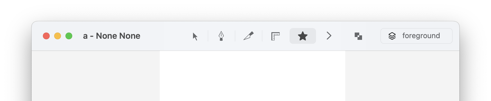
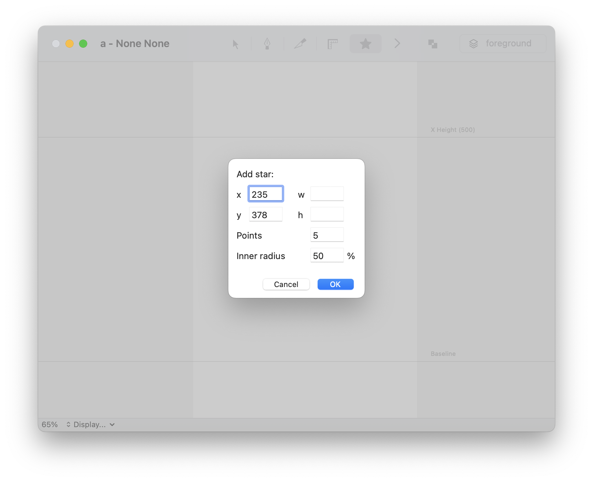

Star Tool
==========

An interactive tool to draw stars with given number of points and inner radius.

**Credits:** This extension is widely based on Frederik Berlaen's [Shape Tool extension](https://github.com/typemytype/shapeToolRoboFontExtension/)

Installation
------------

Download and double-click the `.roboFontExt` file in the Releases section to install manually, or get it via [Mechanic2](http://robofontmechanic.com/).

When installed, StarTool becomes available from the Glyph Editor’s toolbar.

Usage
-----

- open the Glyph Editor
- click on the StarTool icon to activate it 

<!-- add a nice simple .gif screencast here -->

### Actions

The following actions are supported:

| action                     | description                                                   |
| -------------------------- | ------------------------------------------------------------- |
| click + drag               | define the size of the star interactively                     |
| click + drag + arrow up    | add a point to the star                                       |
| click + drag + arrow down  | remove a point from the star                                  |
| click + drag + arrow left  | remove one percent from the star's inner radius               |
| click + drag + arrow right | add one percent to the star's inner radius                    |
| ⌃ + click + drag           | move the star around with fixed size                          |
| ⌘ + click + drag           | define the star size from center                              |
| double click               | show a modal window for nummerical input of position and size |

